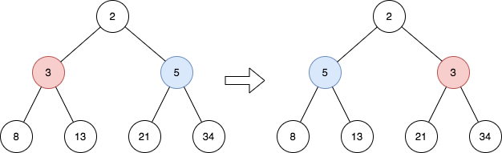
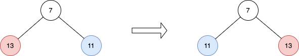

# 2415. Reverse Odd Levels of Binary Tree

Given the `root` of a perfect binary tree, reverse the node values at each odd level of the tree.

- For example, suppose the node values at level 3 are `[2,1,3,4,7,11,29,18]`, then it should become `[18,29,11,7,4,3,1,2]`.

Return the root of the reversed tree.

A binary tree is perfect if all parent nodes have two children and all leaves are on the same level.

The level of a node is the number of edges along the path between it and the root node.

# Example 1

| input                       | Output               | Explanation                                                                                                                                |
|-----------------------------|----------------------|--------------------------------------------------------------------------------------------------------------------------------------------|
| `root = [2,3,5,8,13,21,34]` | `[2,5,3,8,13,21,34]` | <ul><li>The tree has only one odd level.</li><li>The nodes at level 1 are 3, 5 respectively, which are reversed and become 5, 3.</li></ul> |

# Example 2

| input              | Output      | Explanation                                                            |
|--------------------|-------------|------------------------------------------------------------------------|
| `root = [7,13,11]` | `[7,11,13]` | The nodes at level 1 are 13, 11, which are reversed and become 11, 13. |

# Example 3

| input                                    | Output                            | Explanation                                                                                                                                                                                                                                  |
|------------------------------------------|-----------------------------------|----------------------------------------------------------------------------------------------------------------------------------------------------------------------------------------------------------------------------------------------|
| `root = [0,1,2,0,0,0,0,1,1,1,1,2,2,2,2]` | `[0,2,1,0,0,0,0,2,2,2,2,1,1,1,1]` | <ul><li>The odd levels have non-zero values.</li><li>The nodes at level 1 were 1, 2, and are 2, 1 after the reversal.</li><li>The nodes at level 3 were 1, 1, 1, 1, 2, 2, 2, 2, and are 2, 2, 2, 2, 1, 1, 1, 1 after the reversal.</li></ul> |

# Constraints

- The number of nodes in the tree is in the range `[1, 214]`.
- `0 <= Node.val <= 10^5`
- `root` is a perfect binary tree.