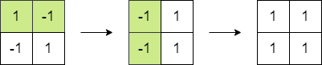
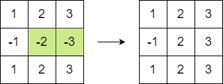

# 1975. Maximum Matrix Sum

You are given an `n x n` integer `matrix`. You can do the following operation any number of times:

- Choose any two adjacent elements of `matrix` and multiply each of them by `-1`.

Two elements are considered adjacent if and only if they share a border.

Your goal is to maximize the summation of the matrix's elements. Return the maximum sum of the matrix's elements using the operation mentioned above.

#### Example 1:

| input                      | Output | Explanation                                                                                                                                                                          |
|----------------------------|--------|--------------------------------------------------------------------------------------------------------------------------------------------------------------------------------------|
| `matrix = [[1,-1],[-1,1]]` | `4`    | We can follow the following steps to reach sum equals 4:<ul><li>Multiply the 2 elements in the first row by -1.</li><li>Multiply the 2 elements in the first column by -1.</li></ul> |

#### Example 2:

| input                                   | Output | Explanation                                                                                                                     |
|-----------------------------------------|--------|---------------------------------------------------------------------------------------------------------------------------------|
| `matrix = [[1,2,3],[-1,-2,-3],[1,2,3]]` | `16`   | We can follow the following step to reach sum equals 16:<ul><li>Multiply the 2 last elements in the second row by -1.</li></ul> |

#### Constraints:

- `n == matrix.length == matrix[i].length`
- `2 <= n <= 250`
- `-10^5 <= matrix[i][j] <= 10^5`