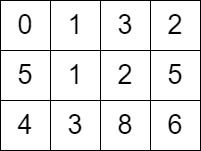
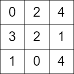

# 2290. Minimum Obstacle Removal to Reach Corner

You are given a `m x n` matrix `grid` consisting of non-negative integers where `grid[row][col]` represents the minimum time required to be able to visit the cell `(row, col)`, which means you can visit the cell `(row, col)` only when the time you visit it is greater than or equal to `grid[row][col]`.

You are standing in the top-left cell of the matrix in the `0th` second, and you must move to any adjacent cell in the four directions: up, down, left, and right. Each move you make takes 1 second.

Return the minimum time required in which you can visit the bottom-right cell of the matrix. If you cannot visit the bottom-right cell, then return `-1`.

# Example 1

| input                                    | Output | Explanation                                                                                                                                                                                                                                                                                                                                                                                                                                                                                                                                                                                                                                                                                                                                                                                                                                                                                             |
|------------------------------------------|--------|---------------------------------------------------------------------------------------------------------------------------------------------------------------------------------------------------------------------------------------------------------------------------------------------------------------------------------------------------------------------------------------------------------------------------------------------------------------------------------------------------------------------------------------------------------------------------------------------------------------------------------------------------------------------------------------------------------------------------------------------------------------------------------------------------------------------------------------------------------------------------------------------------------|
| `grid = [[0,1,3,2],[5,1,2,5],[4,3,8,6]]` | `7`    | <ul><li>One of the paths that we can take is the following:</li><li>It can be shown that we need to remove at least 2 obstacles, so we return 2.</li><li>at t = 0, we are on the cell (0,0).</li><li>at t = 1, we move to the cell (0,1). It is possible because grid[0][1] <= 1.</li><li>at t = 2, we move to the cell (1,1). It is possible because grid[1][1] <= 2.</li><li>at t = 3, we move to the cell (1,2). It is possible because grid[1][2] <= 3.</li><li>at t = 4, we move to the cell (1,1). It is possible because grid[1][1] <= 4.</li><li>at t = 5, we move to the cell (1,2). It is possible because grid[1][2] <= 5.</li><li>at t = 6, we move to the cell (1,3). It is possible because grid[1][3] <= 6.</li><li>at t = 7, we move to the cell (2,3). It is possible because grid[2][3] <= 7.</li><li>The final time is 7. It can be shown that it is the minimum time possible.</li> |

# Example 2

| input                              | Output | Explanation                                                  |
|------------------------------------|--------|--------------------------------------------------------------|
| `grid = [[0,2,4],[3,2,1],[1,0,4]]` | `-1`   | There is no path from the top left to the bottom-right cell. |

# Constraints

- `m == grid.length`
- `n == grid[i].length`
- `2 <= m, n <= 1000`
- `4 <= m * n <= 10^5`
- `0 <= grid[i][j] <= 105`.
- `grid[0][0] == 0`